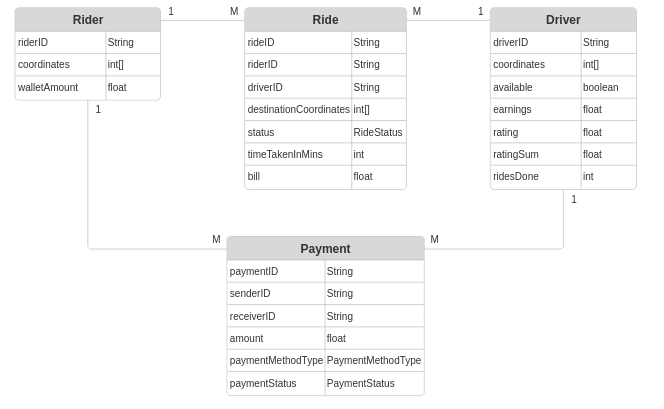

# RideMate

RideMate is a console-based and RESTAPI-enabled ride-hailing application written in Java using **Spring Boot**. It supports both **CLI commands** and **REST API endpoints** for managing rides, drivers, and riders.

**Deployed Link:** https://ridemate-ikfj.onrender.com

## Features
- **CLI Mode**: Interact with the system through terminal commands.
- **REST API Mode**: Use HTTP requests to manage rides and users.
- **H2 Database**: Stores data using an in-memory database.
- **Flexible Payment System**: Supports multiple payment methods via interfaces.
- **Unit & Integration Testing**: Tested using JUnit and MockMvc.

---

## Model Diagram


---
## Installation & Setup
### **1. Clone the Repository**
```sh
git clone https://github.com/Abheelash-Mishra/RideMate.git
cd riderapp
```

### **2. Install Dependencies**
Ensure you have **Maven** installed. Then, run this to generate the package:
```sh
mvn clean install
```

### **3. Running in CLI Mode**
To run it in CLI mode, enter the following command into your terminal.
```sh
java -jar target/riderapp-1.0.jar cli
```

Now, you can run the CLI application. Below is a command sequence example.
```sh
ADD_DRIVER d1@email.com 9876556789 1 1
ADD_DRIVER d1@email.com 9876556789 4 5
ADD_DRIVER d1@email.com 9876556789 2 2
ADD_RIDER r1@email.com 9876556789 0 0
MATCH 1
START_RIDE 2 1 Beach 4 5
STOP_RIDE 1 32
BILL 1
```

### **4. Running as a REST API**
Since RiderApp is a Spring Boot application, it has an embedded Apache Tomcat server. Simply run the application by:
1. Running this command:
   ```sh
   java -jar target/riderapp-1.0.jar
   ```
         
2. Access the API at `http://localhost:8080/`


#### **API Endpoints**
| Method     | Endpoint                  | Description               |
|------------|---------------------------|---------------------------|
| **POST**   | `/driver/add`             | Add a driver              |
| **POST**   | `/driver/rate`            | Rate a driver             |
| **POST**   | `/payment/pay`            | Pay for a ride            |
| **POST**   | `/payment/add-money`      | Add money to wallet       |
| **POST**   | `/ride/rider/add`         | Add a rider               |
| **GET**    | `/ride/match/`            | Match rider with a driver |
| **POST**   | `/ride/start/`            | Start a ride              |
| **POST**   | `/ride/stop/`             | Stop a ride               |
| **GET**    | `/ride/bill/`             | Generate bill for a ride  |
| **GET**    | `/admin/drivers/earnings` | List a driver's earnings  |
| **DELETE** | `/admin/drivers/remove`   | Remove a driver           |
| **GET**    | `/admin/drivers/list`     | List N drivers            |

Test with **Postman** or **cURL**:
```sh
curl -X POST http://localhost:8080/riderapp/ride/rider/add?email=test@gmail.com&phoneNumber=9876556789&x=0&y=0
```

---


# Testing

### **Run Tests**

To run the unit and integration tests for this project, you can use the following command:

```sh
mvn test
```

This will run all tests and show the results in the terminal.

---

## Performance Report

The following table summarizes the API performance tested using [k6](https://k6.io). Metrics were gathered across various virtual user (VU) counts and durations.

| Script Name             | VUs   | Duration | Avg R.D | Min R.D | Max R.D   | p(90) R.D. | p(95) R.D. | Success Rate |
|-------------------------|-------|----------|---------|---------|-----------|------------|------------|--------------|
| **register_drivers.js** | 1000  | 1m       | 0.65 ms | 0.36 ms | 9.09 ms   | 0.76 ms    | 0.79 ms    | 100%         |
|                         | 5000  | 1m       | 0.58 ms | 0.32 ms | 13.43 ms  | 0.71 ms    | 0.77 ms    | 100%         |
|                         | 10000 | 2m       | 0.65 ms | 0.36 ms | 9.09 ms   | 0.75 ms    | 0.79 ms    | 100%         |
| **test_ride_flow.js**   | 1000  | 1m       | 1.90 ms | 0.37 ms | 42.82 ms  | 6.95 ms    | 7.90 ms    | 100%         |
|                         | 5000  | 1m30s    | 2.29 ms | 0.31 ms | 166.23 ms | 8.42 ms    | 10.83 ms   | 100%         |
|                         | 10000 | 2m       | 4.05 ms | 0.31 ms | 453.42 ms | 10.29 ms   | 12.98 ms   | 100%         |
| **test_admin_usage.js** | 100   | 30s      | 1.88 ms | 0.89 ms | 10.28 ms  | 3.13 ms    | 3.31 ms    | 100%         |
|                         | 500   | 30s      | 1.70 ms | 0.45 ms | 13.06 ms  | 2.97 ms    | 3.54 ms    | 100%         |
|                         | 1000  | 30s      | 1.96 ms | 0.59 ms | 13.64 ms  | 3.36 ms    | 3.91 ms    | 100%         |

> **Notes:**
> - R.D. = Response Duration
> - `p(90)` and `p(95)` refer to the 90th and 95th percentile response times respectively.

**See [performance_tests.md](/performance_test/performance_tests.md) for detailed screenshots and graphs of each test run.**

## k6 Installation For Performance Testing

### **Install k6 from GitHub Releases**

To install **k6** on your machine using GitHub releases, follow these steps:

1. **Download the latest k6 release**

   Go to the [k6 GitHub Releases page](https://github.com/grafana/k6/releases) and find the latest release. At the time of writing, we're focusing on **k6 v0.58.0**. You can download the `.tar.gz` or `.zip` file for your operating system (Linux, macOS, or Windows).

   Alternatively, run the following commands to download the release directly:

   ```sh
   curl -LO https://github.com/grafana/k6/releases/download/v0.58.0/k6-v0.58.0-linux-amd64.tar.gz
   ```

2. **Extract the downloaded file**

   After downloading, extract the file:

   ```sh
   tar -xvzf k6-v0.58.0-linux-amd64.tar.gz
   ```

3. **Move the k6 binary to `~/bin` and add it to your PATH**

   Move the `k6` binary to a directory included in your `PATH`:

   ```sh
   mv k6-v0.58.0-linux-amd64/k6 ~/bin
   ```
   
   Next ensure you have `export PATH=$HOME/bin:$PATH` added at the end of your `.bashrc` file. To do so, edit the file using nano:
   
   ```sh
   nano ~/.bashrc
   ```
   
   To execute the changes:

   ```sh
   source ~/.bashrc
   ```

4. **Verify the installation**

   To verify that k6 has been installed correctly, run:

   ```sh
   k6 version
   ```

### **Running k6 Scripts**

Before running the scripts, ensure that the API is live!

```sh
mvn package
java -jar target/riderapp-1.0.jar
```

After installing k6, you can use it to run load testing scripts. Here's how to run the scripts. First edit the options to reflect the type of test you want to run, and adjust the VU count. Then in your terminal, run the following command:

```sh
cd performance_test
k6 run register_drivers.js
```

**OR**

```sh
cd performance_test
k6 run test_ride_flow.js
```

This will execute the script, which makes requests to the API and imitate how a real user traffic would be. k6 will then display the results in your terminal after the test completes, showing you important metrics like the request rate, response time, and more.