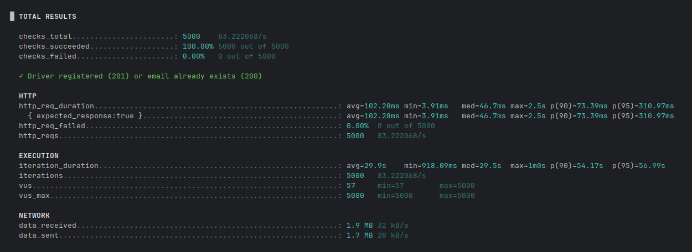
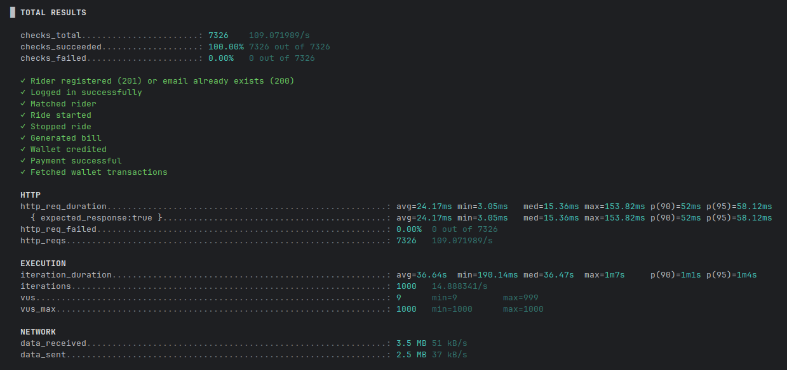
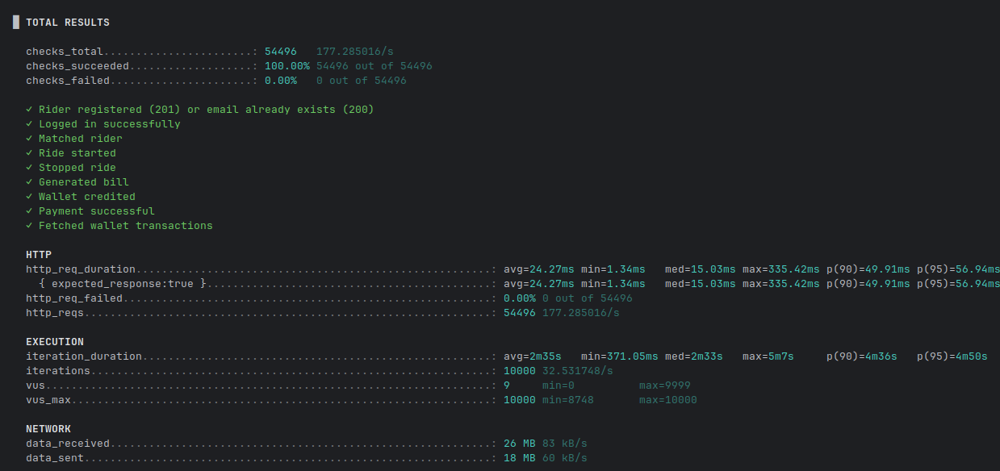

# Performance Test Screenshots

This document contains the results of performance tests executed using **k6**. Each scenario simulates real-world API usage under varying loads, showcasing system behavior across varying Virtual User (VU) counts and durations.

---

## Script: `register_drivers.js`

### 🔸 1000 VUs | Duration: 1m

---

### 🔸 5000 VUs | Duration: 1m

---

### 🔸 10000 VUs | Duration: 2m

---

## Script: `test_ride_flow.js`

### 🔸 1000 VUs | Duration: 1m

---

### 🔸 5000 VUs | Duration: 1m30s

---

### 🔸 10000 VUs | Duration: 2m
