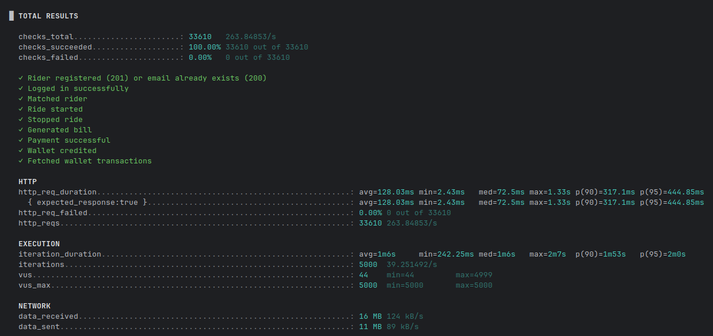
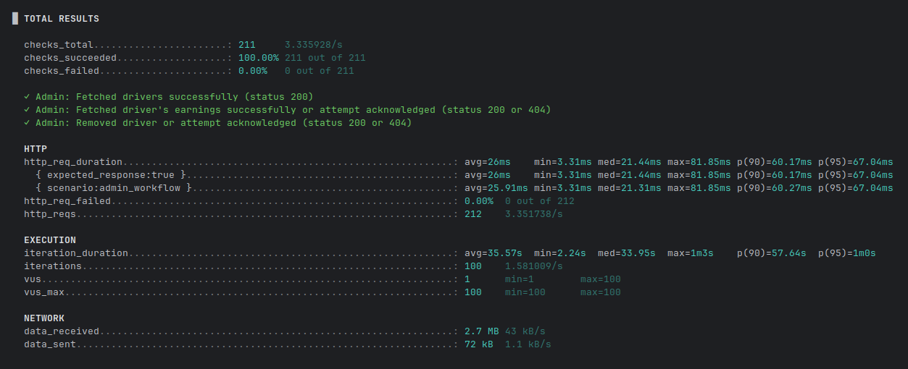
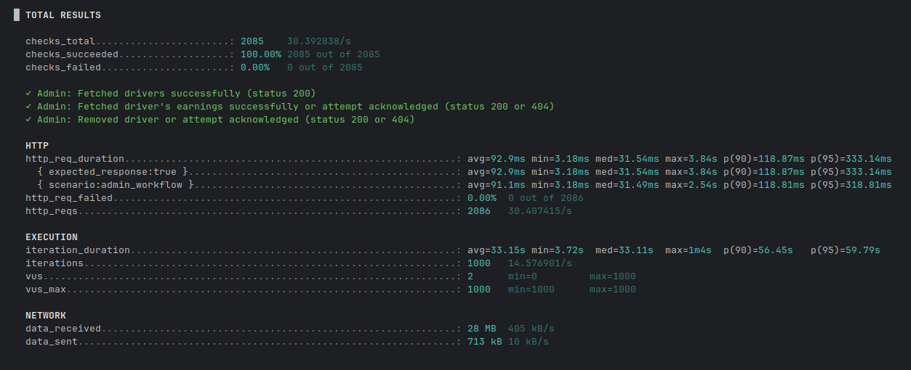

# Performance Test Screenshots

This document contains the results of performance tests executed using **k6**. Each scenario simulates real-world API usage under varying loads, showcasing system behavior across varying Virtual User (VU) counts and durations.

---

## Script: `register_drivers.js`

### 🔸 1000 VUs | Duration: 1m | [Report Link](https://ridemate-eta.vercel.app/register_drivers_1000VU.html)

### 🔸 5000 VUs | Duration: 1m | [Report Link](https://ridemate-eta.vercel.app/register_drivers_5000VU.html)

### 🔸 10000 VUs | Duration: 2m | [Report Link](https://ridemate-eta.vercel.app/register_drivers_10000VU.html)

---

## Script: `test_ride_flow.js`

### 🔸 1000 VUs | Duration: 1m | [Report Link](https://ridemate-eta.vercel.app/test_ride_flow_1000VU.html)

### 🔸 5000 VUs | Duration: 1m30s | [Report Link](https://ridemate-eta.vercel.app/test_ride_flow_5000VU.html)

### 🔸 10000 VUs | Duration: 2m | [Report Link](https://ridemate-eta.vercel.app/test_ride_flow_10000VU.html)

---

## Script: `test_admin_usage.js`

### 🔸 100 VUs | Duration: 30s | [Report Link](https://ridemate-eta.vercel.app/test_admin_usage_100VU.html)

### 🔸 500 VUs | Duration: 30s | [Report Link](https://ridemate-eta.vercel.app/test_admin_usage_500VU.html)

### 🔸 1000 VUs | Duration: 30s | [Report Link](https://ridemate-eta.vercel.app/test_admin_usage_1000VU.html)

